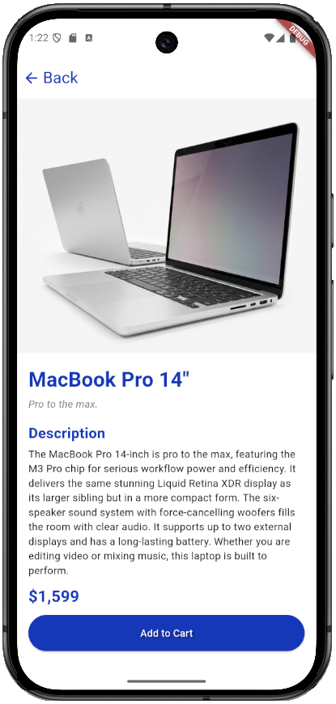
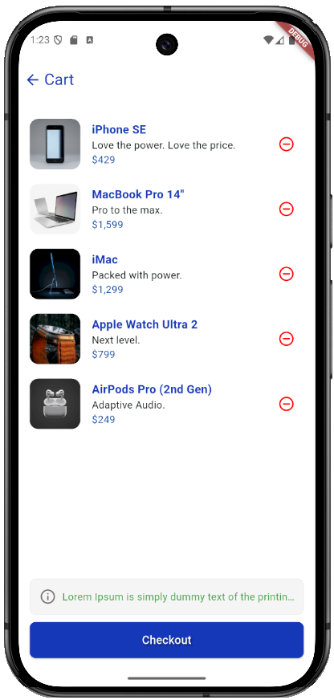

# 📝 Flutter E-Commerce App

Bu proje, e-ticaret uygulaması geliştirmek isteyenler için Flutter kullanılarak oluşturulmuş bir örnek uygulamadır. Uygulama, kullanıcıların ürünleri arayabileceği, detaylarını görebileceği ve sepetlerine ekleyebileceği temel özelliklere sahiptir.

## ✨ Özellikler

- **Ana Sayfa:** Program açıldığında karşımıza çıkan sayfa.
- **Arama Çubuğu:** Kullanıcının yazarak arama yapabildiği bölüm.
- **Sepete Ekleme Bölümü:** Ürünüm detayının bulunduğu ve sepete ekleme seçeneğinin bulunduğu sayfa.
- **Sepet Sayfası:** Sepete eklenen ürünlerin listelendiği ve isteğe göre sepetten çıkartma işlemlerinin bulunduğu sayfa.

## 🚀 Kullanılan Teknolojiler

- Flutter versiyon 3.41.3
- Dart versiyon 3.11.1
- Android Studio - Android 16.0 - Api 36.0

## 📸 Ekran Görüntüleri / Screenshots

_Ana Ekran Görünümü:_

_Ürün Detayı Sayfası Görünümü:_

_Arama Filtresi Görünümü_

_Sepet Sayfası Görünümü_

